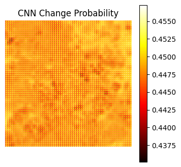
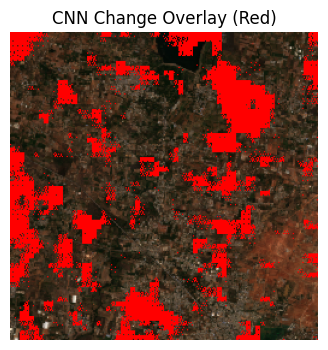
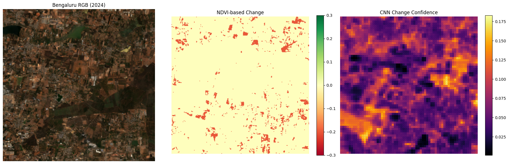

# Urban Change Detection using NDVI and Siamese CNN  
**Case Study: Bengaluru (2017 → 2024)**

This project analyzes urban and vegetation change in Bengaluru using two complementary approaches:

1. **NDVI-based change detection** (classical remote sensing method)
2. **Siamese CNN-based change detection** (deep learning approach)

The goal is to compare pixel-level spectral change with learned spatial–contextual change patterns.

---

##  Motivation

- NDVI thresholding is fast and interpretable but noisy and brittle
- CNNs can learn **context, shape, and texture** beyond raw spectral change
- Comparing both highlights **where ML adds value** over classical indices

---

##  Data

- **Satellite source:** Sentinel-2
- **Spatial resolution:** 10 m (resampled where required)
- **Inputs:**
  - RGB images (2017, 2024)
  - NDVI maps (2017, 2024)
- **Labels:**
  - NDVI-based vegetation loss mask (proxy ground truth)

---

##  Methodology

###  NDVI-based Change Detection

NDVI is computed as:

$$
NDVI = \frac{NIR - Red}{NIR + Red}
$$

Change is calculated as:

$$
\Delta NDVI = NDVI_{2024} - NDVI_{2017}
$$

Vegetation loss is detected using a fixed threshold:

- `ΔNDVI < -0.1 → Change`

This produces a **binary change mask** and an **overlay visualization**.

---

###  CNN-based Change Detection (Siamese Network)

- Two shared-weight CNN encoders process:
  - RGB 2017
  - RGB 2024
- Feature difference is learned implicitly
- Output is a **per-pixel change probability map**
- Trained using NDVI-derived labels

**Key properties:**
- Learns spatial context
- Suppresses pixel noise
- Produces smooth confidence maps instead of hard thresholds

---

##  Results & Visualizations

---

### CNN Change Probability & Overlay

#### CNN Change Probability Map


#### CNN Change Overlay (Red = Detected Change)


---

###  RGB Inputs and NDVI Change

#### Bengaluru RGB (2017 vs 2024) and NDVI Change


---

###  NDVI Binary Change & Overlay

#### NDVI Binary Change Map (Threshold = 0.1)


#### NDVI Detected Change Overlay (Red)


---

### NDVI vs CNN – Heatmap Comparison

#### NDVI Change vs CNN Change Confidence


---

###  Final Side-by-Side Comparison

#### RGB (2024) | NDVI-based Change | CNN Confidence


---

##  Quantitative Observations

- **NDVI change**
  - Sensitive to illumination, soil exposure, seasonal effects
  - Produces scattered false positives
- **CNN confidence**
  - Smoother spatial structure
  - Captures urban expansion patterns
  - Less sensitive to pixel-level noise

**Change ratio statistics (CNN):**
- Min: ~0.02
- Max: ~0.17
- Mean: ~0.08

---

##  Why CNN when NDVI already shows change?

| Aspect | NDVI | CNN |
|------|------|-----|
| Interpretability | High | Medium |
| Noise sensitivity | High | Low |
| Context awareness | No | Yes |
| Shape learning | No | Yes |
| Generalization | Limited | Strong |

NDVI answers **“did reflectance change?”**  
CNN answers **“does this look like meaningful change?”**

---

##  Limitations

- CNN trained on NDVI-derived labels (not human-annotated ground truth)
- Single-city case study
- Seasonal effects not explicitly modeled

---

##  Future Work

- Multi-city generalization
- Temporal sequences (LSTM / Transformer)
- Multi-spectral CNN input (beyond RGB)
- Human-annotated validation set
- Streamlit interactive demo

---

##  Repository Structure

```
.
├── figures/
│   ├── CNN-CHANGE-PROBABLITY.png
│   ├── CNN-overlay.png
│   ├── NDVI change.png
│   ├── NDVI-OVERLAY.png
│   ├── output heat.png
│   └── output.png
├── dataset/
├── final_research.ipynb
├── requirements.txt
├── .gitignore
└── README.md
```


---

##  License

This project is for educational and research purposes.

---

##  Author
-Rajvardhan Chhugani – chhuganirajvardhan@gmail.com
-Developed as a **remote sensing + deep learning case study** to demonstrate practical urban change detection.
